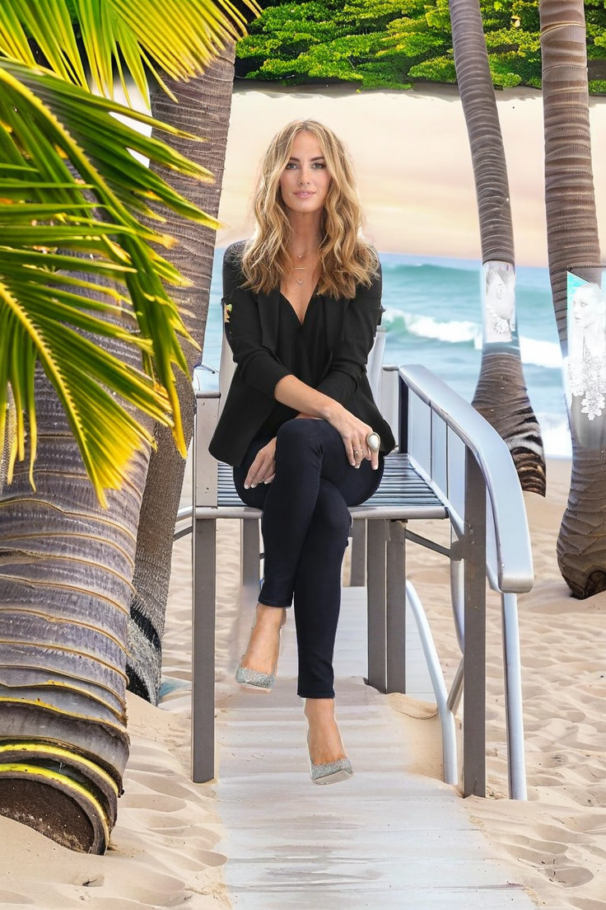
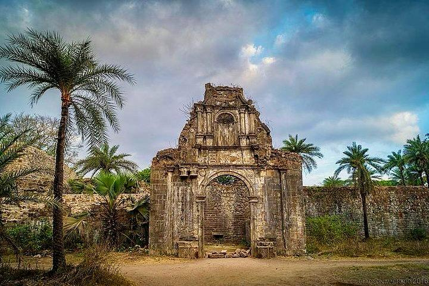

# Amazon Bedrock Examples Open Source Repo

This repository contains examples of using the Amazon Titan V2, Amazon Nova Canvas and Nova Reel SOTA (State-Of-The-Art) Frontier FM Models. By leveraging the Bedrock service, you can perform video generation and high-quality Image background removal / change at a fraction of the cost of typical image editing apps.

## Features

- **Low-Cost Processing:** Video generation, remove/replace image backgrounds for just a few cents using Amazon Bedrock.
- **High Accuracy:** Utilizes the Titan Image V2, Nova Canvas, Nova Reel for professional-grade results.
- **Python Automation:** Includes a Python script for easy integration into your workflows.

## Requirements

- AWS account with permissions to use Amazon Bedrock.
- Python 3.8 or later.
- Required Python libraries (see `requirements.txt`).

## Setup

1. **Clone the repository:**
   ```bash
   git clone https://github.com/awsdataarchitect/bedrock-examples.git
   cd bedrock-examples
2. **Install dependencies:**
   ```bash
   pip install -r requirements.txt
3. **Configure AWS credentials:** Ensure your AWS credentials are set up in ~/.aws/credentials or use environment variables.

4. **Run the script:** 

## Amazon Titan and Nova Canvas Model Example for Background Removal
Replace "demo.jpeg" in the script with your image file path and execute:

Amazon Titan Model Example
   ```bash
   python bedrock_titan_image_bg_remove.py
   ```
Amazon Nova Canvas Model Example
   ```bash
   python bedrock_nova_image_bg_remove.py
   ```
Output: The script generates an output_image.png with a transparent background.

Before: 


After:


## Amazon Nova Canvas Model Example for Background Change with Prompt
   ```bash
   python bedrock_nova_image_bg_change_prompt.py prompt_image_bg_demo.jpg "scenic beach sunset palm trees"
   ```
Output: The script generates an output_background_changed.png with a background from the prompt.

Before: 


After:



## Amazon Nova Reel Model for Video Generation
   ```bash
   python bedrock_nova_reel_text2video.py
   ```
Input: 



Output: The script generates a 6 second video in the S3 bucket and the prefix specified in the python script.


## Cost Comparison

Compared to apps charging $10-$20 per image, this solution costs just a few cents per operation using Amazon Bedrock's Titan/Nova models.

## Contributing

Feel free to submit issues, suggest features, or open pull requests.

## License

This project is licensed under the MIT License.